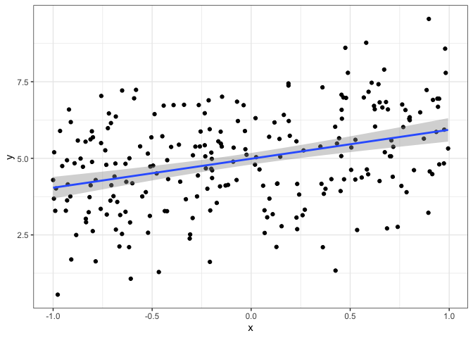
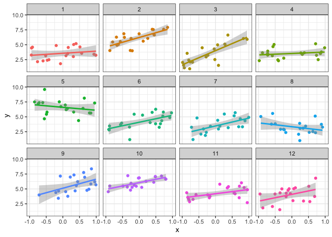

Hierarchical Models Demo
================

1.  Simulate data from a “random slopes, random intercept” model
    framework.

``` r
m <- 12 # number of groups
mu_alpha <- 5
sigmasq_alpha <- 1
alpha <- rnorm(m, mu_alpha, sigmasq_alpha)

mu_beta <- 1
sigmasq_beta <- 1
beta <- rnorm(m, mu_beta, sigmasq_beta)


n <- 20
x <- runif(n * m, -1, 1)

mean_val <- rep(alpha, each =n) + x * rep(beta, each = n)
y <- rnorm(m * n, mean = mean_val, sd = 1 )

hm_dat <- tibble( y = y, x = x, group = factor(rep(1:m, each = n)) )
```

1.  Create a plot that displays the simulated data, in this figure
    ignore the groups.

``` r
hm_dat %>% ggplot(aes(y=y, x=x)) +
  geom_point()  + geom_smooth(formula = 'y~x', method = 'lm') + theme_bw() 
```

<!-- -->

1.  Now create a figure (faceted and/or colored) that highlights the
    group differences.

``` r
hm_dat %>% ggplot(aes(y=y, x=x, color = group)) +
  geom_point() + facet_wrap(.~ group) + geom_smooth(formula = 'y~x', method = 'lm') +
  theme_bw() + theme(legend.position = 'none')
```

<!-- -->

1.  Fit the model and compare the estimated values with simulated values

``` r
lmer_mod <- lmer(y ~ x + (1 + x|group), data = hm_dat)
summary(lmer_mod)
```

    ## Linear mixed model fit by REML ['lmerMod']
    ## Formula: y ~ x + (1 + x | group)
    ##    Data: hm_dat
    ## 
    ## REML criterion at convergence: 756.7
    ## 
    ## Scaled residuals: 
    ##      Min       1Q   Median       3Q      Max 
    ## -2.51748 -0.67389 -0.07403  0.69062  2.85296 
    ## 
    ## Random effects:
    ##  Groups   Name        Variance Std.Dev. Corr
    ##  group    (Intercept) 1.3311   1.1537       
    ##           x           0.6128   0.7828   0.04
    ##  Residual             1.0845   1.0414       
    ## Number of obs: 240, groups:  group, 12
    ## 
    ## Fixed effects:
    ##             Estimate Std. Error t value
    ## (Intercept)   4.5187     0.3402  13.282
    ## x             0.8559     0.2570   3.331
    ## 
    ## Correlation of Fixed Effects:
    ##   (Intr)
    ## x 0.031

``` r
coef(lmer_mod) 
```

    ## $group
    ##    (Intercept)          x
    ## 1     3.606066  0.4580728
    ## 2     6.134115  1.4099645
    ## 3     3.958166  2.0752722
    ## 4     3.573426  0.3379310
    ## 5     6.518058 -0.2011935
    ## 6     4.113780  1.1091299
    ## 7     3.525618  1.1864100
    ## 8     3.343530 -0.3083152
    ## 9     5.152279  1.3506080
    ## 10    5.994689  1.0619675
    ## 11    4.203469  0.7292433
    ## 12    4.101065  1.0618191
    ## 
    ## attr(,"class")
    ## [1] "coef.mer"

``` r
cbind(alpha, beta)
```

    ##          alpha       beta
    ##  [1,] 3.687382  0.2967294
    ##  [2,] 5.894598  0.6996909
    ##  [3,] 3.924260  2.7692028
    ##  [4,] 3.827991  0.5336841
    ##  [5,] 6.096089 -0.3401407
    ##  [6,] 4.242684  1.4296552
    ##  [7,] 3.567909  1.4902418
    ##  [8,] 3.356430 -0.5630050
    ##  [9,] 5.212346  1.8776402
    ## [10,] 5.991906  0.7665090
    ## [11,] 4.246026  0.9403839
    ## [12,] 4.083216  1.4912666

``` r
glmer_mod <- stan_glmer(y ~ x + (1 + x|group), data = hm_dat)
print(glmer_mod)
```

    ## stan_glmer
    ##  family:       gaussian [identity]
    ##  formula:      y ~ x + (1 + x | group)
    ##  observations: 240
    ## ------
    ##             Median MAD_SD
    ## (Intercept) 4.5    0.4   
    ## x           0.9    0.3   
    ## 
    ## Auxiliary parameter(s):
    ##       Median MAD_SD
    ## sigma 1.0    0.0   
    ## 
    ## Error terms:
    ##  Groups   Name        Std.Dev. Corr
    ##  group    (Intercept) 1.27         
    ##           x           0.93     0.03
    ##  Residual             1.05         
    ## Num. levels: group 12 
    ## 
    ## ------
    ## * For help interpreting the printed output see ?print.stanreg
    ## * For info on the priors used see ?prior_summary.stanreg

``` r
coef(glmer_mod)
```

    ## $group
    ##    (Intercept)          x
    ## 1     3.617072  0.4610914
    ## 2     6.130063  1.3953837
    ## 3     3.958195  2.0591540
    ## 4     3.574130  0.3458137
    ## 5     6.513112 -0.1787809
    ## 6     4.118946  1.1200273
    ## 7     3.534643  1.1761843
    ## 8     3.339293 -0.3063068
    ## 9     5.140266  1.3498487
    ## 10    5.986992  1.0462757
    ## 11    4.206329  0.7430814
    ## 12    4.100017  1.0619801
    ## 
    ## attr(,"class")
    ## [1] "coef.mer"

``` r
cbind(alpha, beta)
```

    ##          alpha       beta
    ##  [1,] 3.687382  0.2967294
    ##  [2,] 5.894598  0.6996909
    ##  [3,] 3.924260  2.7692028
    ##  [4,] 3.827991  0.5336841
    ##  [5,] 6.096089 -0.3401407
    ##  [6,] 4.242684  1.4296552
    ##  [7,] 3.567909  1.4902418
    ##  [8,] 3.356430 -0.5630050
    ##  [9,] 5.212346  1.8776402
    ## [10,] 5.991906  0.7665090
    ## [11,] 4.246026  0.9403839
    ## [12,] 4.083216  1.4912666
