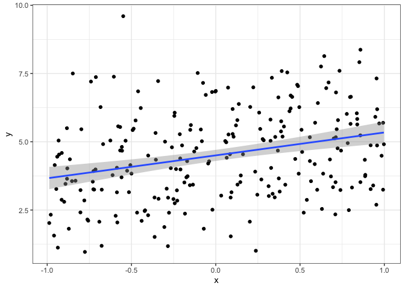

Hierarchical Models Demo
================

1.  Simulate data from a “random slopes, random intercept” model
    framework.

2.  Create a plot that displays the simulated data, in this figure
    ignore the groups.

<!-- -->

3.  Now create a figure (faceted and/or colored) that highlights the
    group differences.

<!-- -->

4.  Fit the model and compare the estimated values with simulated values

<!-- end list -->

    ## Linear mixed model fit by REML ['lmerMod']
    ## Formula: y ~ x + (1 + x | group)
    ##    Data: hm_dat
    ## 
    ## REML criterion at convergence: 773.7
    ## 
    ## Scaled residuals: 
    ##      Min       1Q   Median       3Q      Max 
    ## -2.83403 -0.66311  0.04714  0.60516  2.54362 
    ## 
    ## Random effects:
    ##  Groups   Name        Variance Std.Dev. Corr
    ##  group    (Intercept) 0.9646   0.9821       
    ##           x           0.2627   0.5125   0.20
    ##  Residual             1.2230   1.1059       
    ## Number of obs: 240, groups:  group, 12
    ## 
    ## Fixed effects:
    ##             Estimate Std. Error t value
    ## (Intercept)   4.9835     0.2927  17.024
    ## x             0.9323     0.1935   4.819
    ## 
    ## Correlation of Fixed Effects:
    ##   (Intr)
    ## x 0.165

    ## $group
    ##    (Intercept)         x
    ## 1     6.580794 1.2490822
    ## 2     5.696028 1.0946566
    ## 3     4.520937 1.0374546
    ## 4     6.202594 0.8177062
    ## 5     3.249509 1.1384701
    ## 6     4.746411 1.2282517
    ## 7     4.933863 1.1960608
    ## 8     4.547846 0.5849497
    ## 9     5.013026 1.2434091
    ## 10    5.524153 1.1843900
    ## 11    3.705138 0.3004810
    ## 12    5.082215 0.1130629
    ## 
    ## attr(,"class")
    ## [1] "coef.mer"

    ##          alpha        beta
    ##  [1,] 6.746733  1.24172919
    ##  [2,] 5.733997  1.21640792
    ##  [3,] 4.756321  1.47681431
    ##  [4,] 5.950373  0.01774664
    ##  [5,] 3.490705  1.38489891
    ##  [6,] 4.493651  1.07413236
    ##  [7,] 4.479156  1.55684187
    ##  [8,] 4.807833  0.03034102
    ##  [9,] 5.200753  1.00670834
    ## [10,] 5.601263  1.45514827
    ## [11,] 3.727343 -0.11927665
    ## [12,] 5.090056  0.22837229

    ## stan_glmer
    ##  family:       gaussian [identity]
    ##  formula:      y ~ x + (1 + x | group)
    ##  observations: 240
    ## ------
    ##             Median MAD_SD
    ## (Intercept) 5.0    0.3   
    ## x           0.9    0.2   
    ## 
    ## Auxiliary parameter(s):
    ##       Median MAD_SD
    ## sigma 1.1    0.1   
    ## 
    ## Error terms:
    ##  Groups   Name        Std.Dev. Corr
    ##  group    (Intercept) 1.07         
    ##           x           0.62     0.15
    ##  Residual             1.11         
    ## Num. levels: group 12 
    ## 
    ## ------
    ## * For help interpreting the printed output see ?print.stanreg
    ## * For info on the priors used see ?prior_summary.stanreg

    ## $group
    ##    (Intercept)         x
    ## 1     6.560998 1.2279451
    ## 2     5.697707 1.0821870
    ## 3     4.521794 1.0150817
    ## 4     6.194494 0.8238903
    ## 5     3.261554 1.1290004
    ## 6     4.733528 1.1954295
    ## 7     4.934108 1.1709417
    ## 8     4.554808 0.6139310
    ## 9     5.007053 1.2033829
    ## 10    5.522579 1.1567158
    ## 11    3.724894 0.3450367
    ## 12    5.078636 0.1375139
    ## 
    ## attr(,"class")
    ## [1] "coef.mer"

    ##          alpha        beta
    ##  [1,] 6.746733  1.24172919
    ##  [2,] 5.733997  1.21640792
    ##  [3,] 4.756321  1.47681431
    ##  [4,] 5.950373  0.01774664
    ##  [5,] 3.490705  1.38489891
    ##  [6,] 4.493651  1.07413236
    ##  [7,] 4.479156  1.55684187
    ##  [8,] 4.807833  0.03034102
    ##  [9,] 5.200753  1.00670834
    ## [10,] 5.601263  1.45514827
    ## [11,] 3.727343 -0.11927665
    ## [12,] 5.090056  0.22837229
